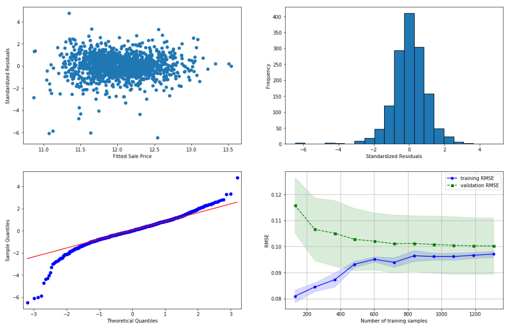
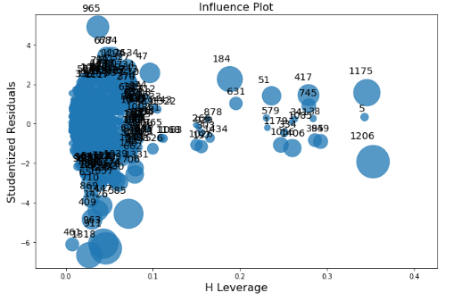
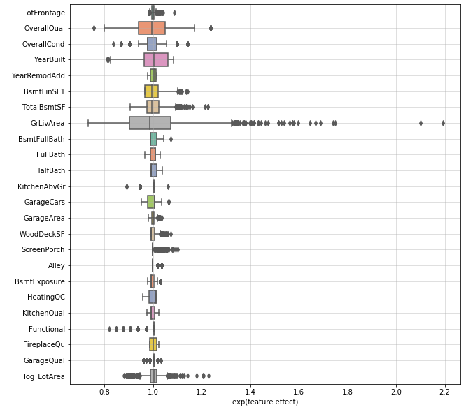

# Advanced Regression Techniques

#### Practicing regression in a Kaggle competition

A "knowledge" competition hosted by Kaggle to practice advanced regression techniques. The aim of participating in this competition was to practice tackling a "typical" regression problem. The notebook includes data cleaning, EDA, building and interpreting the data and the model that I found to perform the best. The data cleaning methods I followed for this particular dataset was inspired by [this](https://www.kaggle.com/pmarcelino/comprehensive-data-exploration-with-python) notebook. I used Linear models (Lasso, OLSR, GLMs etc) and avoided producing multi-model ensembles to boost my leaderboard score to ensure model simplicity and interpretability (see final section of the notebook). 

My final model was a simple OLSR with feature selection performed sequentially using [mlxtend](http://rasbt.github.io/mlxtend/) (0.12090 RMSLE, 1027/4942 on LB as of 24/08/2019).

Things to try in the future to improve my LB score without resorting to ensembling:

- YJT transforms for skewed features
- experiment with different [categorical encoding methods](https://feature-engine.readthedocs.io/en/latest/encoders/index.html#) and [discretisers](https://feature-engine.readthedocs.io/en/latest/discretisers/index.html)
- Create indicator features that flag categorical feature levels that spike the sale price (see step 3 of [this](https://www.kaggle.com/agehsbarg/top-10-0-10943-stacking-mice-and-brutal-force))
- MICE to impute MAR missing values

